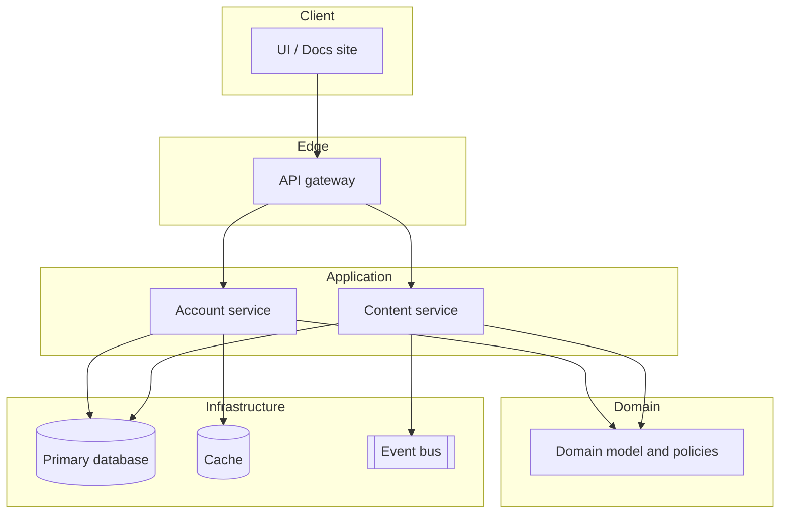

# Sample project architecture

This document describes a **fictional reference application** used as a template for how you might structure and document a small production-style system. It is not tied to a specific framework; adapt names and boundaries to your stack.

## Goals

- Separate **user-facing experience** from **core business rules** and **integration** details.
- Keep **documentation** and **operational** concerns explicit so new contributors can navigate the codebase.

## High-level system

| Layer | Responsibility | Typical artifacts |
|--------|----------------|-------------------|
| **Client** | UI, input validation, session UX | Web or mobile app, static site |
| **API gateway** | Authn/z, rate limits, routing, request shaping | Reverse proxy, BFF, edge functions |
| **Application services** | Use cases, orchestration, transactions | Service modules, application layer |
| **Domain** | Business rules, invariants, domain model | Entities, value objects, domain services |
| **Infrastructure** | Persistence, queues, email, third-party APIs | Repositories, adapters, SDK clients |
| **Platform** | Observability, config, secrets, CI/CD | Logging, metrics, pipelines, IaC |

## Component view (sample)



## Request lifecycle (read path, simplified)

1. **Client** issues an authenticated request to the **gateway** (token or session validated at the edge).
2. **Gateway** forwards to the appropriate **application service** with a stable internal contract.
3. **Service** loads data via **infrastructure** adapters, applying **domain** rules before returning a DTO or view model.
4. **Response** travels back through the gateway; sensitive fields stay server-side.

## Data and consistency

- **Strong consistency** for user-owned writes that must be immediately visible (e.g. account settings) via the primary database.
- **Eventual consistency** where acceptable (e.g. search index, analytics) via outbox or events into **BUS**, processed by workers.

## Cross-cutting concerns

- **Logging**: structured logs with request correlation id from gateway.
- **Metrics**: RED/USE style per service; SLOs on critical paths.
- **Security**: least-privilege service accounts; secrets from a managed store; no secrets in repo.
- **Documentation**: architecture decision records (ADRs) for non-obvious choices; this file kept in sync with major structural changes.

## Repository layout (example)

This repo (`Cursor-doc`) is documentation-centric. A code repository following the above ideas might look like:

```text
/docs
  ARCHITECTURE.md
  adr/
/services
  account/
  content/
/packages
  domain/
  shared-kernel/
```

## Evolution

When the system grows, split **application services** along team boundaries, introduce **read models** for heavy queries, and document new integration points in this file or linked ADRs.
