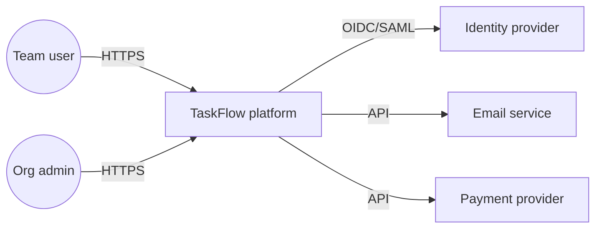
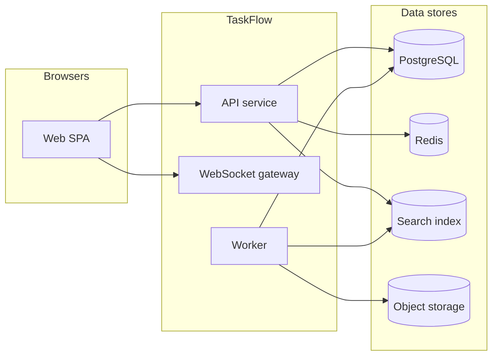

# Sample project architecture — TaskFlow (illustrative)

This document is a **second, concrete example** of how to capture project architecture. For a **layered template** that applies to many stacks, see [`ARCHITECTURE.md`](./ARCHITECTURE.md).

**TaskFlow** is a fictional **B2B task and project tracking** product: teams manage projects, tasks, comments, and notifications. It is described here only as documentation practice.

## 1. System context (C4 Level 1)

| Actor / system | Relationship |
|----------------|----------------|
| **Team user** (browser) | Uses the web app for daily work |
| **Administrator** | Configures org, SSO, billing |
| **Email provider** | Delivers digests and alerts |
| **Payment provider** | Processes subscriptions |
| **IdP (SAML/OIDC)** | Authenticates enterprise customers |

**Central system:** TaskFlow **platform** (single logical product) exposes HTTPS APIs and a SPA to browsers.



## 2. Containers (C4 Level 2)

| Container | Technology (example) | Responsibility |
|-----------|----------------------|------------------|
| **Web SPA** | TypeScript, static hosting | UI, client validation, real-time updates (WebSocket) |
| **API service** | e.g. Java / Node / Go | REST + WebSocket; authz; orchestration |
| **Worker** | Same runtime as API | Async jobs: emails, webhooks, search indexing |
| **Primary DB** | e.g. PostgreSQL | Relational source of truth |
| **Cache** | e.g. Redis | Sessions, hot reads, rate limits |
| **Object storage** | e.g. S3-compatible | Attachments, exports |
| **Search index** | e.g. OpenSearch | Full-text task and comment search |



## 3. Key domain boundaries (sample)

- **Organization** — tenant root; enforces data isolation between customers.
- **Project & task** — core aggregates; tasks belong to projects; comments are child entities.
- **Notification** — rules engine subscribes to domain events; delivery is infrastructure.

## 4. Characteristic sequences

**Create task (sync path):** SPA → API (authn token) → authorize (org role) → persist task → invalidate list cache → return DTO.

**Send “mentioned in comment” email (async path):** API writes comment → outbox/event → Worker consumes → template render → Email provider.

## 5. Non-functional targets (examples)

- **Availability:** 99.9% API monthly (excluding provider outages).
- **Security:** tenant isolation in every query; secrets in vault; audit log for admin actions.
- **Observability:** trace id from gateway through API and workers; SLO on p95 API latency.

## 6. Repository mapping (example monorepo)

```text
/apps/web          # SPA
/apps/api          # HTTP + WS
/apps/worker       # consumers
/packages/contracts   # OpenAPI / shared types
/packages/domain      # pure domain logic (optional split)
/infra               # IaC, environments
```

---

*Illustrative only; replace TaskFlow with your product name and adjust containers to match your real stack.*
